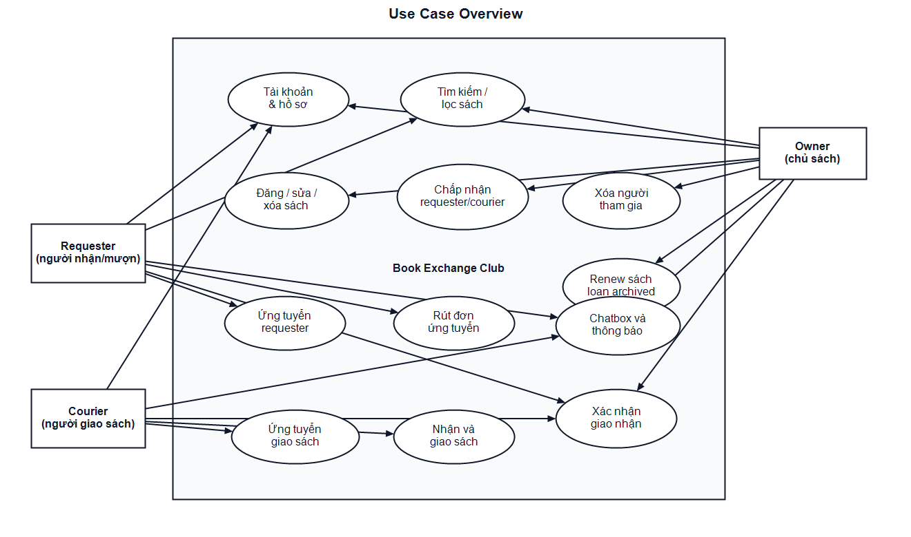
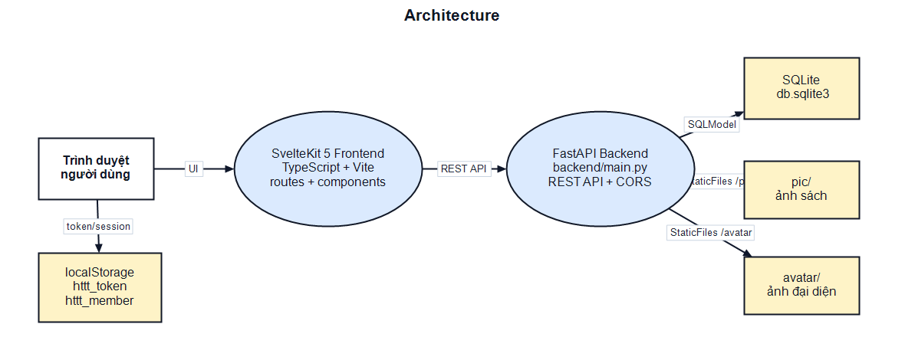
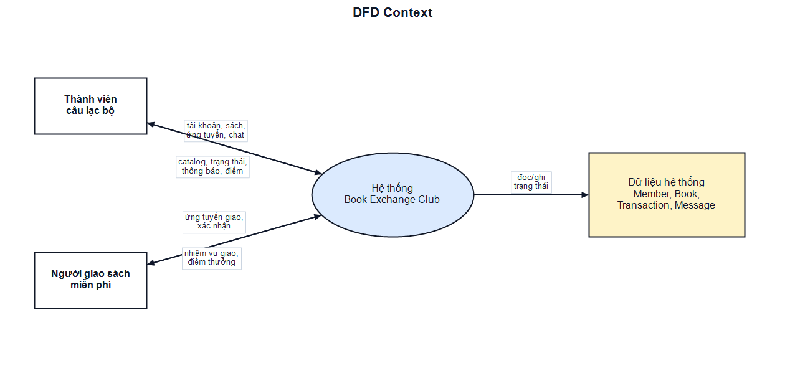
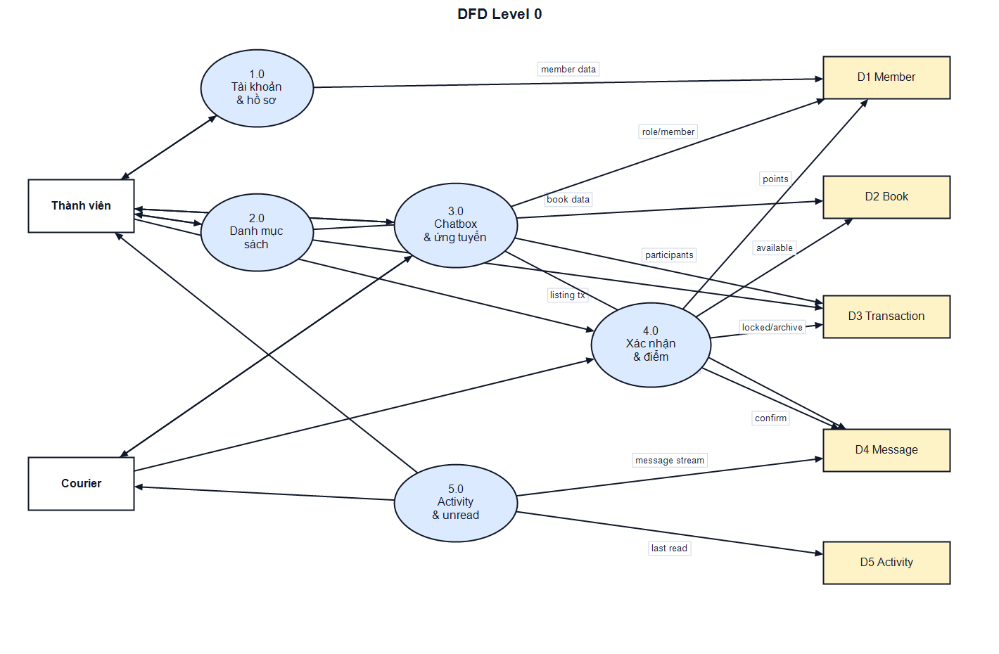
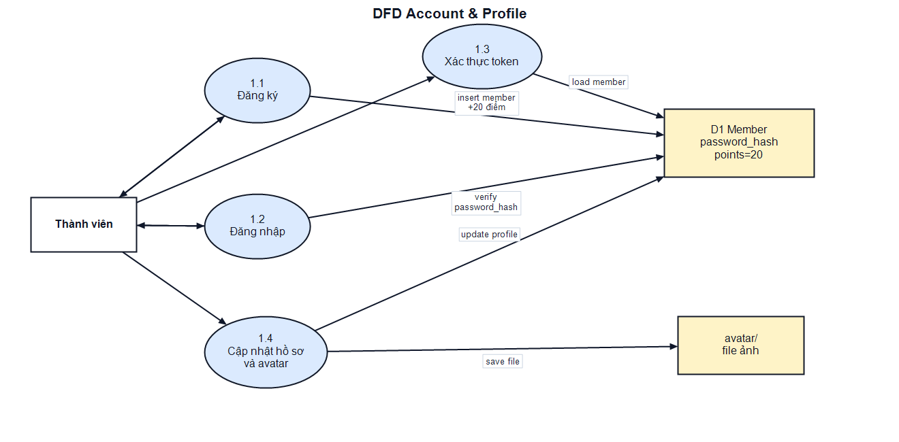
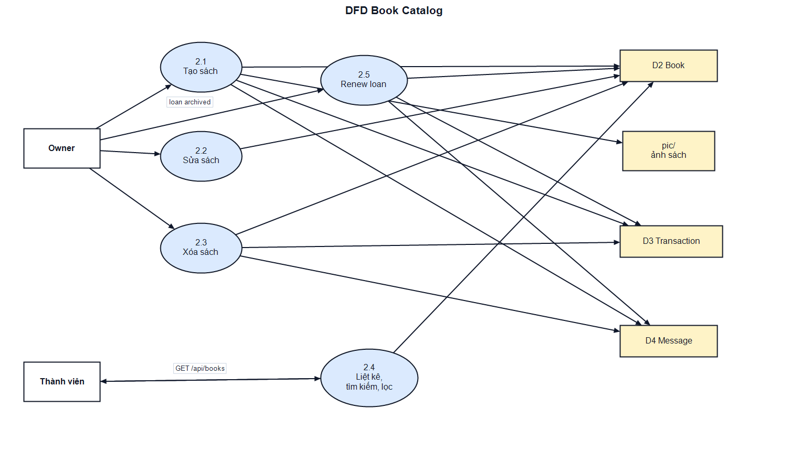
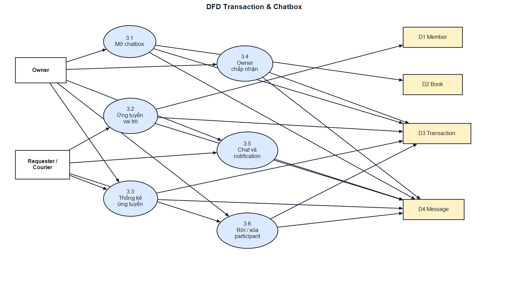
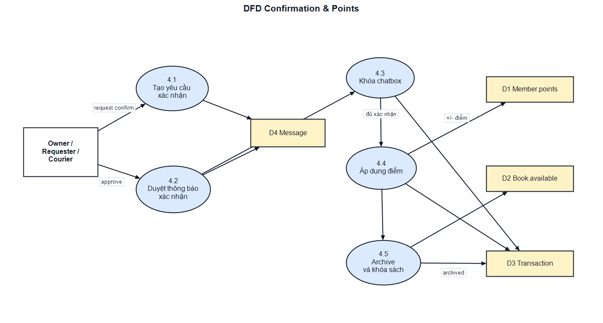
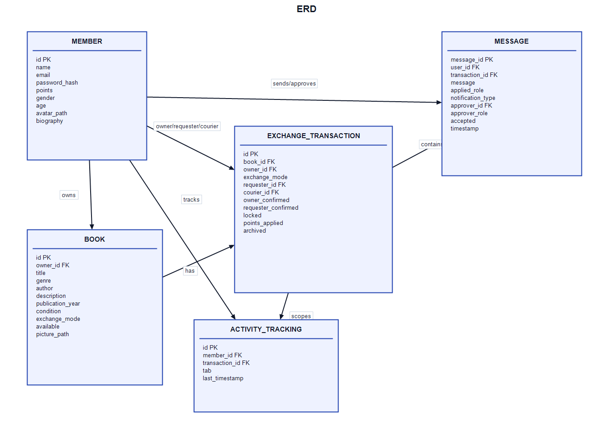

ĐẠI HỌC QUỐC GIA HÀ NỘI
TRƯỜNG ĐẠI HỌC CÔNG NGHỆ

# TÀI LIỆU PHÂN TÍCH THIẾT KẾ HỆ THỐNG

## ĐỀ TÀI

XÂY DỰNG ỨNG DỤNG KẾT NỐI THÀNH VIÊN CÂU LẠC BỘ SÁCH ĐỂ TRAO ĐỔI VÀ CHO MƯỢN SÁCH

Backend: FastAPI + SQLModel + SQLite, triển khai trong `backend/main.py`.

Frontend: SvelteKit 5 + TypeScript + Vite, triển khai trong thư mục `frontend`.

Phiên bản tài liệu: 06/06/2026

<!-- PAGEBREAK -->

# THÔNG TIN NHÓM THỰC HIỆN

Bảng 0.1. Bảng thông tin thực hiện báo cáo

| Họ và tên | Vai trò | Nhiệm vụ |
| --- | --- | --- |
| Nhóm phát triển HTTT | Business Analyst / Technical Writer | Phân tích nghiệp vụ, đặc tả yêu cầu, mô hình hóa hệ thống, lập báo cáo kỹ thuật |
| Backend | FastAPI Developer | Xây dựng API, mô hình dữ liệu, nghiệp vụ điểm, xác nhận giao dịch trong `backend/main.py` |
| Frontend | Svelte Developer | Xây dựng giao diện SvelteKit, luồng đăng nhập, quản lý sách, chatbox, thông báo và hồ sơ |

# MỤC LỤC

1. Chương 1. Tổng quan đề tài
2. Chương 2. Đặc tả yêu cầu hệ thống
3. Chương 3. Thiết kế kiến trúc tổng thể
4. Chương 4. Thiết kế kỹ thuật chi tiết
5. Chương 5. Thiết kế giao diện người dùng - UI/UX
6. Chương 6. Kế hoạch kiểm thử và triển khai
7. Chương 7. Kết luận và hướng phát triển
8. Tài liệu tham khảo

# DANH MỤC TỪ VIẾT TẮT

Bảng 0.2. Bảng danh mục từ viết tắt

| Từ viết tắt | Giải thích |
| --- | --- |
| API | Application Programming Interface - giao diện lập trình ứng dụng |
| BA | Business Analyst - chuyên viên phân tích nghiệp vụ |
| CORS | Cross-Origin Resource Sharing - cơ chế cho phép frontend gọi backend khác origin |
| CRUD | Create, Read, Update, Delete - nhóm thao tác dữ liệu cơ bản |
| DFD | Data Flow Diagram - sơ đồ luồng dữ liệu |
| ERD | Entity Relationship Diagram - sơ đồ thực thể liên kết |
| JWT | JSON Web Token - chuỗi token xác thực được ký |
| MVP | Minimum Viable Product - phiên bản khả dụng tối thiểu |
| REST | Representational State Transfer - phong cách thiết kế API HTTP |
| SQLModel | Thư viện Python kết hợp SQLAlchemy và Pydantic để khai báo model dữ liệu |
| SQLite | Hệ quản trị cơ sở dữ liệu nhúng, lưu trong file `db.sqlite3` |
| UI/UX | User Interface / User Experience - giao diện và trải nghiệm người dùng |

# DANH MỤC HÌNH ẢNH

Hình 2.1. Sơ đồ Use Case tổng quát của hệ thống

Hình 3.1. Sơ đồ kiến trúc tổng thể của hệ thống

Hình 3.2. Sơ đồ DFD mức ngữ cảnh

Hình 3.3. Sơ đồ DFD mức 0

Hình 3.4. Phân rã Tiến trình 1.0 - Quản lý tài khoản và hồ sơ

Hình 3.5. Phân rã Tiến trình 2.0 - Quản lý danh mục sách

Hình 3.6. Phân rã Tiến trình 3.0 - Quản lý chatbox và ứng tuyển vai trò

Hình 3.7. Phân rã Tiến trình 4.0 - Xác nhận giao nhận và cập nhật điểm

Hình 4.1. Sơ đồ ERD của hệ thống

# DANH MỤC BẢNG BIỂU

Bảng 1.1. Bảng công nghệ sử dụng

Bảng 2.1. Bảng quy định nghiệp vụ cốt lõi

Bảng 2.2. Bảng yêu cầu chức năng

Bảng 2.3. Bảng yêu cầu phi chức năng

Bảng 2.4 - 2.15. Các bảng đặc tả use case chính

Bảng 4.1 - 4.5. Các bảng đặc tả dữ liệu

Bảng 4.6. Bảng đặc tả API

Bảng 5.1. Bảng danh sách màn hình chính

Bảng 5.2. Bảng đặc tả kiểm soát giao diện

Bảng 6.1. Bảng kịch bản kiểm thử

Bảng 6.2. Bảng môi trường triển khai

<!-- PAGEBREAK -->

# CHƯƠNG 1. TỔNG QUAN ĐỀ TÀI

## 1.1. Giới thiệu đề tài

Đề tài hướng đến việc xây dựng một ứng dụng hỗ trợ các thành viên câu lạc bộ sách trao đổi hoặc cho mượn sách thông qua một nền tảng tập trung. Người dùng có thể đăng sách của mình, tìm kiếm sách của người khác, ứng tuyển để nhận hoặc mượn sách, tham gia chatbox theo từng giao dịch và xác nhận giao nhận để hệ thống cập nhật điểm thưởng.

Ứng dụng được triển khai theo mô hình prototype có đầy đủ luồng nghiệp vụ chính. Backend nằm trong một file duy nhất `backend/main.py`, sử dụng FastAPI để cung cấp REST API, SQLModel để khai báo bảng dữ liệu, SQLite để lưu dữ liệu cục bộ và thư mục tĩnh `pic/`, `avatar/` để lưu hình ảnh. Frontend nằm trong thư mục `frontend`, sử dụng SvelteKit 5, TypeScript, Svelte runes và Vite.

Về bản chất nghiệp vụ, hệ thống không chỉ là danh mục sách. Trọng tâm của ứng dụng là điều phối quan hệ ba vai trò trong một giao dịch: chủ sách, người nhận/mượn sách và người giao sách tự nguyện. Điểm thưởng được dùng như một cơ chế khuyến khích trao đổi: thành viên mới có 20 điểm, chủ sách nhận điểm khi trao đổi thành công, người nhận/mượn bị trừ điểm, người giao sách nhận 2 điểm khi giao hàng thành công.

## 1.2. Lý do chọn đề tài

Trong hoạt động câu lạc bộ sách, việc trao đổi sách thường diễn ra qua tin nhắn riêng, bài đăng rời rạc hoặc trao đổi trực tiếp. Cách làm này có một số hạn chế:

- Danh sách sách đang có nhu cầu trao đổi không được tập trung.
- Thành viên khó biết sách nào còn khả dụng, sách nào đã có người nhận, sách nào đang trong quá trình giao nhận.
- Việc mượn/trả hoặc trao đổi vĩnh viễn thiếu cơ chế ghi nhận trạng thái rõ ràng.
- Thành viên sẵn sàng hỗ trợ giao sách không có kênh riêng để nhận vai trò giao sách.
- Điểm thưởng nếu quản lý thủ công sẽ dễ sai lệch, đặc biệt khi cần xác nhận từ nhiều bên.

Ứng dụng giải quyết các vấn đề trên bằng cách đưa danh mục sách, chatbox giao dịch, ứng tuyển vai trò, xác nhận giao nhận và điểm thưởng vào cùng một luồng dữ liệu.

## 1.3. Mục tiêu xây dựng hệ thống

Mục tiêu tổng quát là xây dựng một ứng dụng web phục vụ trao đổi sách trong phạm vi câu lạc bộ. Các mục tiêu cụ thể gồm:

- Cho phép thành viên đăng ký tài khoản, đăng nhập và duy trì phiên làm việc bằng token.
- Cấp 20 điểm ban đầu cho mỗi thành viên mới.
- Cho phép thành viên cập nhật hồ sơ cá nhân, ảnh đại diện và thông tin giới thiệu.
- Cho phép thành viên đăng sách với tiêu đề, thể loại, tác giả, mô tả, năm xuất bản, tình trạng, hình thức trao đổi và ảnh sách.
- Hỗ trợ hai hình thức: trao đổi vĩnh viễn (`permanent`) và cho mượn (`loan`).
- Cho phép người quan tâm ứng tuyển làm requester hoặc courier trong từng chatbox giao dịch.
- Cho phép chủ sách chấp nhận, xóa hoặc thay thế requester/courier.
- Cho phép các bên đã được chấp nhận chat và nhận thông báo trong từng giao dịch.
- Cập nhật điểm sau khi quá trình giao nhận được xác nhận đầy đủ.
- Duy trì Archive như lớp ghi nhận giao dịch read-only để các thành viên liên quan có thể xem lại vai trò, trạng thái và biến động điểm sau khi hoàn tất.
- Lưu vết tin nhắn, thông báo, trạng thái đọc và trạng thái giao dịch.

## 1.4. Phạm vi hệ thống

### 1.4.1. Phạm vi chức năng

Phạm vi triển khai hiện tại bao gồm thành viên câu lạc bộ, sách, giao dịch, chatbox, thông báo, xác nhận giao nhận và điểm thưởng. Hệ thống không có vai trò quản trị riêng; quyền thao tác chủ yếu dựa trên quan hệ sở hữu sách hoặc vai trò đã được chấp nhận trong giao dịch.

Các nhóm chức năng chính:

- Quản lý tài khoản: đăng ký, đăng nhập, đọc thông tin phiên hiện tại.
- Quản lý hồ sơ: xem hồ sơ công khai, sửa hồ sơ cá nhân, upload avatar.
- Quản lý sách: tạo, sửa, xóa, xem danh sách, tìm kiếm và lọc sách.
- Quản lý chatbox: mở chatbox theo sách, ứng tuyển requester/courier, rút đơn, chấp nhận, rời hoặc xóa thành viên khỏi chatbox.
- Quản lý thông báo: tạo thông báo hệ thống trong chatbox, phê duyệt thông báo có yêu cầu xác nhận, thống kê unread.
- Quản lý xác nhận giao nhận: xác nhận trực tiếp owner-requester hoặc xác nhận hai chặng owner-courier và courier-requester.
- Quản lý điểm: kiểm tra điểm khả dụng trước khi requester ứng tuyển, áp dụng cộng/trừ điểm khi giao dịch hoàn tất.
- Lưu trữ giao dịch hoàn tất: đưa transaction đã archived vào khu vực Archive như một lớp record minh bạch giữa owner, requester và courier.
- Gia hạn sách cho mượn: chủ sách có thể tạo listing mới từ một giao dịch loan đã archived.

### 1.4.2. Giới hạn của hệ thống

Đây là một prototype tập trung vào demo nghiệp vụ, do đó có một số giới hạn:

- Chưa có phân quyền quản trị nâng cao ngoài quyền chủ sở hữu sách và vai trò trong giao dịch.
- Chưa có xác thực OAuth hoặc xác minh email.
- Chatbox dùng polling định kỳ 1.8 giây thay vì WebSocket realtime.
- Cơ sở dữ liệu dùng SQLite cục bộ, phù hợp prototype hơn là triển khai nhiều người dùng quy mô lớn.
- Token JWT dùng secret môi trường `JWT_SECRET`, nhưng mặc định vẫn có fallback local.
- Chưa có cơ chế trả sách riêng cho giao dịch `loan`; trạng thái hiện tại tập trung vào hoàn tất giao nhận ban đầu và cho phép renew listing sau khi archived.
- Chưa có kiểm thử tự động đi kèm trong repository hiện tại.

## 1.5. Công nghệ sử dụng

Bảng 1.1. Bảng công nghệ sử dụng

| Thành phần | Công nghệ sử dụng | Vai trò trong hệ thống |
| --- | --- | --- |
| Backend | FastAPI | Xây dựng REST API, xử lý request/response, khai báo route trong `backend/main.py` |
| ORM / Schema | SQLModel | Khai báo model bảng và model payload theo kiểu Python type hint |
| Database | SQLite | Lưu dữ liệu thành viên, sách, giao dịch, tin nhắn và trạng thái hoạt động trong `db.sqlite3` |
| Static file | FastAPI StaticFiles | Phục vụ ảnh sách trong `/pic/*` và avatar trong `/avatar/*` |
| Authentication | JWT tự cài đặt bằng HMAC SHA-256 | Sinh/đọc bearer token, lưu token phía frontend |
| Frontend | SvelteKit 5 | Xây dựng route giao diện, trạng thái reactive và điều hướng |
| Language frontend | TypeScript | Định nghĩa type cho Member, Book, Transaction, Message và các response API |
| Build tool | Vite | Chạy dev server và build frontend |
| UI icons | `@lucide/svelte` | Icon cho button, tab, trạng thái, thông báo và thao tác |

# CHƯƠNG 2. ĐẶC TẢ YÊU CẦU HỆ THỐNG

## 2.1. Khảo sát hiện trạng

### 2.1.1. Quy trình hiện tại

Trước khi có hệ thống, một câu lạc bộ sách thường trao đổi theo quy trình thủ công:

1. Thành viên đăng thông tin sách lên nhóm chat hoặc thông báo trực tiếp.
2. Người quan tâm liên hệ riêng với chủ sách.
3. Hai bên tự thỏa thuận nhận sách, mượn sách hoặc nhờ người giao hộ.
4. Nếu có điểm thưởng, điểm được ghi nhận thủ công sau khi hai bên báo đã hoàn tất.
5. Lịch sử giao dịch, tin nhắn và trạng thái sách không được lưu tập trung.

### 2.1.2. Vấn đề tồn tại

Quy trình thủ công dẫn tới các vấn đề nghiệp vụ đáng chú ý:

- Khó kiểm soát trạng thái sách vì một sách có thể được nhiều người quan tâm cùng lúc.
- Không có dữ liệu rõ ràng để biết ai đang là requester hoặc courier của giao dịch.
- Người giao sách miễn phí khó tìm được giao dịch cần hỗ trợ.
- Chủ sách khó theo dõi nhiều yêu cầu khác nhau nếu chỉ dùng tin nhắn riêng.
- Điểm thưởng dễ bị cộng/trừ sớm nếu chưa có xác nhận giao nhận đầy đủ.
- Thành viên không có nơi xem lại lịch sử chatbox hoặc thông báo liên quan đến mình.

### 2.1.3. Nhu cầu xây dựng hệ thống mới

Hệ thống mới cần tạo ra một kênh tập trung để đăng sách, nhận yêu cầu, trao đổi trong chatbox, xác nhận giao nhận và cập nhật điểm. Mọi giao dịch phải có trạng thái rõ ràng: mở, có requester/courier, locked, points_applied và archived. Khi giao dịch đã archived, khu vực Archive đóng vai trò như lớp ghi nhận giao dịch để các bên liên quan có thể xem lại lịch sử, vai trò và biến động điểm, qua đó tăng tính minh bạch giữa các thành viên. Các thao tác nhạy cảm như chấp nhận requester/courier, xóa người tham gia hoặc cập nhật điểm phải được kiểm soát bằng role trong giao dịch.

## 2.2. Yêu cầu nghiệp vụ

### 2.2.1. Mục tiêu nghiệp vụ

Mục tiêu nghiệp vụ là giúp câu lạc bộ sách vận hành việc trao đổi sách minh bạch, có khuyến khích bằng điểm và giảm phụ thuộc vào thỏa thuận rời rạc bên ngoài hệ thống. Thành viên có thể nhìn thấy sách khả dụng, chủ sách quản lý sách của mình, requester/courier ứng tuyển theo từng giao dịch, và điểm chỉ thay đổi khi giao nhận được xác nhận đúng.

### 2.2.2. Quy trình nghiệp vụ As-is

1. Chủ sách thông báo sách trong nhóm chung.
2. Người cần sách nhắn riêng cho chủ sách.
3. Nếu cần giao hộ, hai bên tự tìm người hỗ trợ.
4. Các bên tự xác nhận bằng lời nói hoặc tin nhắn riêng.
5. Điểm nếu có được cập nhật thủ công.

### 2.2.3. Quy trình nghiệp vụ To-be

1. Thành viên đăng ký tài khoản và nhận 20 điểm.
2. Thành viên đăng sách lên hệ thống, hệ thống tạo Book và mở ExchangeTransaction tương ứng.
3. Các thành viên khác xem danh sách Available, tìm kiếm/lọc theo tên, tác giả, thể loại, năm, tình trạng, owner và exchange mode.
4. Người quan tâm vào màn hình chi tiết sách, ứng tuyển làm requester hoặc courier.
5. Chủ sách xem notification/join request và chấp nhận requester/courier phù hợp.
6. Các bên được chấp nhận trao đổi trong chatbox.
7. Khi gặp nhau, các bên tạo notification xác nhận giao nhận.
8. Hệ thống kiểm tra đúng cặp người xác nhận và đúng thứ tự giao nhận.
9. Khi đủ xác nhận, hệ thống cập nhật điểm, khóa sách, archived giao dịch, xóa các join request chưa xử lý và hiển thị bản ghi trong Archive.
10. Với sách loan đã archived, chủ sách có thể renew để tạo listing mới.

### 2.2.4. Quy định nghiệp vụ

Bảng 2.1. Bảng quy định nghiệp vụ cốt lõi

| Mã | Quy định | Diễn giải triển khai |
| --- | --- | --- |
| BR01 | Thành viên mới có 20 điểm | `register` và `create_member` tạo `Member.points = 20` |
| BR02 | Permanent exchange có giá trị 10 điểm | `points_for_mode("permanent")` trả về 10 |
| BR03 | Loan có giá trị 5 điểm | `points_for_mode("loan")` trả về 5 |
| BR04 | Requester bị trừ điểm sau khi hoàn tất | `complete_transaction_if_ready` trừ điểm requester theo exchange mode |
| BR05 | Owner được cộng điểm sau khi hoàn tất | `complete_transaction_if_ready` cộng điểm owner theo exchange mode |
| BR06 | Courier được cộng 2 điểm nếu có tham gia | `complete_transaction_if_ready` cộng 2 điểm cho courier khi `courier_id` tồn tại |
| BR07 | Requester phải đủ điểm khả dụng trước khi ứng tuyển | `ensure_requester_budget` kiểm tra điểm đã bị giữ bởi các request active/pending |
| BR08 | Owner không được tự ứng tuyển vào sách của mình | `apply_to_chatbox` chặn `member.id == transaction.owner_id` |
| BR09 | Requester và courier phải là hai người khác nhau | `apply_to_chatbox` và `accept_participant` kiểm tra xung đột vai trò |
| BR10 | Chỉ owner được chấp nhận hoặc xóa requester/courier | `accept_participant` và `kick_participant` kiểm tra `owner_id` |
| BR11 | Chatbox locked sau khi bắt đầu giao nhận vật lý | `lock_transaction` đặt `locked=True` và xóa join request |
| BR12 | Điểm chỉ áp dụng một lần | `complete_transaction_if_ready` bỏ qua nếu `points_applied=True` |
| BR13 | Giao dịch hoàn tất sẽ archived | `complete_transaction_if_ready` đặt `archived=True` |
| BR14 | Sách hoàn tất sẽ không còn available | `confirm_meeting` hoặc approval path đặt `Book.available=False` |
| BR15 | Archive là lớp record giao dịch minh bạch | Frontend lọc transaction archived liên quan đến member và hiển thị trong Archive/read-only chatbox |

## 2.3. Yêu cầu chức năng

Bảng 2.2. Bảng yêu cầu chức năng

| Mã | Tác nhân | Chức năng | Mô tả |
| --- | --- | --- | --- |
| F01 | Thành viên | Đăng ký tài khoản | Tạo tài khoản bằng name, email, password, gender, age; nhận 20 điểm và token |
| F02 | Thành viên | Đăng nhập | Xác thực email/password và nhận bearer token |
| F03 | Thành viên | Quản lý hồ sơ | Xem hồ sơ công khai, sửa hồ sơ của chính mình, upload avatar |
| F04 | Owner | Đăng sách | Tạo sách mới với thông tin bibliographic, exchange mode và ảnh sách |
| F05 | Owner | Sửa/xóa sách | Cập nhật sách của mình hoặc xóa khi chatbox chưa có participant và chưa locked/archived |
| F06 | Thành viên | Tìm kiếm và lọc sách | Lọc sách theo condition, year, exchange mode, owner và full-text search |
| F07 | Requester | Ứng tuyển nhận/mượn sách | Gửi join request với vai trò requester nếu đủ điểm khả dụng |
| F08 | Courier | Ứng tuyển giao sách | Gửi join request với vai trò courier |
| F09 | Owner | Chấp nhận participant | Chấp nhận requester/courier từ join request trong chatbox |
| F10 | Participant | Chat trong giao dịch | Gửi và xem tin nhắn nếu đã được chấp nhận vào chatbox |
| F11 | Participant | Nhận thông báo | Xem notification, join request, leave/kick, handoff confirmation |
| F12 | Participant | Xác nhận giao nhận | Tạo/approve confirmation notification theo đúng cặp owner-requester hoặc owner-courier-requester |
| F13 | Hệ thống | Cập nhật điểm | Cộng/trừ điểm sau khi đủ xác nhận |
| F14 | Owner | Gia hạn sách loan | Tạo listing mới từ loan book đã archived |
| F15 | Thành viên | Theo dõi unread | Xem số lượng message unread ở dropdown, chatbox và notification tab |
| F16 | Thành viên | Xem record giao dịch archived | Xem lại giao dịch đã hoàn tất trong Archive, gồm sách, người tham gia, trạng thái read-only và biến động điểm |

## 2.4. Yêu cầu phi chức năng

Bảng 2.3. Bảng yêu cầu phi chức năng

| Nhóm yêu cầu | Nội dung |
| --- | --- |
| Tính đúng đắn nghiệp vụ | Điểm chỉ được cập nhật sau khi giao dịch đủ xác nhận; mỗi giao dịch chỉ áp dụng điểm một lần |
| Minh bạch giao dịch | Archive giữ các transaction đã hoàn tất như record read-only để owner, requester và courier xem lại vai trò, lịch sử và điểm thay đổi |
| Dễ sử dụng | Giao diện chia rõ My books, Accepted, Applying, Available, Archive; màn hình detail có tab Book info, Chatbox, Notification |
| Phản hồi gần thời gian thực | Frontend polling mỗi 1.8 giây để cập nhật sách, giao dịch, message và unread count |
| Bảo mật cơ bản | Password được hash bằng PBKDF2-HMAC-SHA256 với salt; API hồ sơ kiểm tra bearer token khi cập nhật |
| Khả chuyển giao | Backend một file giúp đọc nhanh toàn bộ API/model/business rule trong `backend/main.py` |
| Khả mở rộng | Có thể tách router/service, thay SQLite bằng database server và thay polling bằng WebSocket ở giai đoạn sau |
| Khả dụng dữ liệu | SQLite tạo bảng khi startup; có migration nhỏ cho database prototype cũ |
| Tính nhất quán UI | Dùng component ListingSection và ConfirmModal để thống nhất list/filter/modal |

## 2.5. Sơ đồ Use Case tổng quát

Hình 2.1. Sơ đồ Use Case tổng quát của hệ thống



Nguon so do: `docs/report_assets/diagrams/src/use_case_overview.mmd`


## 2.6. Đặc tả chi tiết các Use Case chính

### 2.6.1. Use Case Đăng ký tài khoản

Bảng 2.4. Bảng use case Đăng ký tài khoản

| Nội dung | Mô tả |
| --- | --- |
| Tên Use Case | Đăng ký tài khoản |
| Actor | Thành viên mới |
| Mục tiêu | Tạo tài khoản và nhận 20 điểm ban đầu |
| Tiền điều kiện | Email chưa tồn tại; password tối thiểu 4 ký tự |
| Luồng chính | Người dùng nhập name, email, password, gender, age; frontend gọi `POST /api/auth/register`; backend chuẩn hóa email/gender/age, hash password, tạo Member, trả token và member |
| Luồng thay thế | Nếu email đã tồn tại, password quá ngắn, name rỗng hoặc age/gender không hợp lệ, backend trả lỗi 400 |
| Kết quả | localStorage lưu token/member; người dùng được điều hướng tới `/books` |

### 2.6.2. Use Case Đăng nhập

Bảng 2.5. Bảng use case Đăng nhập

| Nội dung | Mô tả |
| --- | --- |
| Tên Use Case | Đăng nhập |
| Actor | Thành viên |
| Mục tiêu | Xác thực tài khoản để sử dụng hệ thống |
| Tiền điều kiện | Tài khoản đã được đăng ký |
| Luồng chính | Người dùng nhập email/password; frontend gọi `POST /api/auth/login`; backend kiểm tra password hash và trả bearer token |
| Luồng thay thế | Nếu email hoặc password sai, backend trả 401 |
| Kết quả | Người dùng vào màn hình `/books`; header hiển thị tên, tổng điểm và điểm khả dụng |

### 2.6.3. Use Case Cập nhật hồ sơ

Bảng 2.6. Bảng use case Cập nhật hồ sơ

| Nội dung | Mô tả |
| --- | --- |
| Tên Use Case | Cập nhật hồ sơ |
| Actor | Thành viên đã đăng nhập |
| Mục tiêu | Cập nhật name, gender, age, biography và avatar |
| Tiền điều kiện | Người dùng có bearer token hợp lệ và chỉ sửa hồ sơ của chính mình |
| Luồng chính | Frontend gửi FormData tới `PUT /api/members/{member_id}/profile`; backend xác thực token, kiểm tra owner profile, lưu avatar nếu có, cập nhật Member |
| Luồng thay thế | Nếu token không hợp lệ hoặc sửa hồ sơ người khác, backend trả 401/403 |
| Kết quả | Profile page và session member được refresh |

### 2.6.4. Use Case Đăng sách

Bảng 2.7. Bảng use case Đăng sách

| Nội dung | Mô tả |
| --- | --- |
| Tên Use Case | Đăng sách |
| Actor | Owner |
| Mục tiêu | Tạo một listing sách để trao đổi hoặc cho mượn |
| Tiền điều kiện | Người dùng đã đăng nhập; exchange mode thuộc `permanent` hoặc `loan` |
| Luồng chính | Owner nhập title, genre, author, description, publication_year, condition, exchange_mode và ảnh; frontend gọi `POST /api/books`; backend tạo Book, tạo ExchangeTransaction mở, thêm Message "Posted book" |
| Luồng thay thế | Nếu exchange_mode không hợp lệ hoặc ảnh không phải image, backend trả 400 |
| Kết quả | Sách xuất hiện trong My books của owner và Available đối với người khác nếu chưa locked/archived |

### 2.6.5. Use Case Tìm kiếm và lọc sách

Bảng 2.8. Bảng use case Tìm kiếm và lọc sách

| Nội dung | Mô tả |
| --- | --- |
| Tên Use Case | Tìm kiếm và lọc sách |
| Actor | Thành viên |
| Mục tiêu | Nhanh chóng tìm sách phù hợp |
| Tiền điều kiện | Người dùng đã đăng nhập và truy cập `/books` |
| Luồng chính | Frontend tải `/api/books`, `/api/transactions`, sau đó ListingSection lọc client-side theo condition, publication year, exchange mode, owner, text search |
| Luồng thay thế | Nếu backend tạm lỗi, UI giữ trạng thái hiện tại khi refresh realtime thất bại |
| Kết quả | Danh sách sách được phân nhóm My books, Accepted, Applying, Available, Archive |

### 2.6.6. Use Case Ứng tuyển requester/courier

Bảng 2.9. Bảng use case Ứng tuyển requester/courier

| Nội dung | Mô tả |
| --- | --- |
| Tên Use Case | Ứng tuyển requester/courier |
| Actor | Requester hoặc Courier |
| Mục tiêu | Gửi yêu cầu tham gia chatbox theo vai trò |
| Tiền điều kiện | Chatbox chưa locked/archived; người dùng không phải owner; người dùng chưa là participant trong giao dịch |
| Luồng chính | Người dùng chọn role và nhập introduction note; frontend gọi `POST /api/transactions/{id}/apply`; backend kiểm tra role, điểm requester, xung đột requester/courier, sau đó tạo join_request Message |
| Luồng thay thế | Nếu requester không đủ điểm khả dụng hoặc role xung đột, backend trả 400 |
| Kết quả | Owner thấy join request trong Notification; applicant thấy sách trong Applying |

### 2.6.7. Use Case Owner chấp nhận hoặc xóa participant

Bảng 2.10. Bảng use case Owner chấp nhận hoặc xóa participant

| Nội dung | Mô tả |
| --- | --- |
| Tên Use Case | Owner chấp nhận hoặc xóa participant |
| Actor | Owner |
| Mục tiêu | Quản lý requester/courier trong chatbox |
| Tiền điều kiện | Người thao tác là owner của transaction; chatbox chưa locked |
| Luồng chính | Owner approve join request hoặc gọi endpoint accept/kick; backend cập nhật `requester_id` hoặc `courier_id`, thay đổi trạng thái message và thêm notification join/kicked |
| Luồng thay thế | Nếu owner_id không khớp hoặc applicant chưa gửi join request, backend trả 403/400 |
| Kết quả | Participant được vào chatbox hoặc bị gỡ khỏi chatbox; confirmation state được reset khi leave/kick |

### 2.6.8. Use Case Chat và thông báo

Bảng 2.11. Bảng use case Chat và thông báo

| Nội dung | Mô tả |
| --- | --- |
| Tên Use Case | Chat và thông báo |
| Actor | Owner, requester, courier đã được chấp nhận |
| Mục tiêu | Trao đổi thông tin và theo dõi sự kiện giao dịch |
| Tiền điều kiện | Người dùng là participant của transaction |
| Luồng chính | Frontend gọi `GET /messages`, `POST /messages`, `GET /application-stats`, `GET /activity/unread`; backend lọc message theo quyền xem và tab |
| Luồng thay thế | Người không phải participant truy cập chatbox sẽ bị backend trả 403 |
| Kết quả | Tin nhắn chat hiển thị trong Chatbox; join/kick/leave/confirmation hiển thị trong Notification |

### 2.6.9. Use Case Xác nhận giao nhận trực tiếp

Bảng 2.12. Bảng use case Xác nhận giao nhận trực tiếp

| Nội dung | Mô tả |
| --- | --- |
| Tên Use Case | Xác nhận giao nhận trực tiếp |
| Actor | Owner và requester |
| Mục tiêu | Hoàn tất giao dịch không có courier |
| Tiền điều kiện | Transaction có requester, không có courier, chưa archived |
| Luồng chính | Một bên tạo notification `confirm_direct_handoff`; bên còn lại approve; backend gọi logic xác nhận meeting với cặp owner-requester, đặt owner_confirmed và requester_confirmed |
| Luồng thay thế | Confirmation hết hạn sau 60 giây nếu không được approve |
| Kết quả | Hệ thống cộng/trừ điểm, đặt points_applied, archived và Book.available=False |

### 2.6.10. Use Case Xác nhận giao nhận qua courier

Bảng 2.13. Bảng use case Xác nhận giao nhận qua courier

| Nội dung | Mô tả |
| --- | --- |
| Tên Use Case | Xác nhận giao nhận qua courier |
| Actor | Owner, courier, requester |
| Mục tiêu | Hoàn tất giao dịch qua hai chặng giao nhận |
| Tiền điều kiện | Transaction có requester và courier |
| Luồng chính | Owner/courier xác nhận chặng owner-courier trước; hệ thống locked chatbox và đặt owner_confirmed. Sau đó courier/requester xác nhận chặng giao tới requester; hệ thống đặt requester_confirmed |
| Luồng thay thế | Nếu requester-courier xác nhận trước owner-courier, backend trả lỗi owner handoff must be confirmed first |
| Kết quả | Owner cộng 10 hoặc 5 điểm, requester trừ 10 hoặc 5 điểm, courier cộng 2 điểm |

### 2.6.11. Use Case Gia hạn sách cho mượn

Bảng 2.14. Bảng use case Gia hạn sách cho mượn

| Nội dung | Mô tả |
| --- | --- |
| Tên Use Case | Gia hạn sách cho mượn |
| Actor | Owner |
| Mục tiêu | Đưa lại một sách `loan` đã hoàn tất lên danh sách mới |
| Tiền điều kiện | Book có exchange_mode `loan`, transaction đã archived, người thao tác là owner |
| Luồng chính | Frontend hiển thị nút Renew trong Archive; owner gọi `POST /api/books/{book_id}/renew`; backend clone Book thành listing mới và mở transaction mới |
| Luồng thay thế | Nếu sách không phải loan hoặc chưa archived, backend trả 400 |
| Kết quả | Listing mới xuất hiện như một sách loan độc lập, lịch sử cũ giữ nguyên |

### 2.6.12. Use Case Theo dõi unread và activity

Bảng 2.15. Bảng use case Theo dõi unread và activity

| Nội dung | Mô tả |
| --- | --- |
| Tên Use Case | Theo dõi unread và activity |
| Actor | Thành viên |
| Mục tiêu | Biết tin nhắn/thông báo mới trong dropdown, chatbox và notification |
| Tiền điều kiện | Người dùng đã đăng nhập |
| Luồng chính | Layout polling `/api/members/{id}/messages`, `/api/activity/unread`; khi mở dropdown hoặc tab, frontend gọi `POST /api/activity` để cập nhật last_timestamp |
| Luồng thay thế | Nếu network lỗi ngắn hạn, UI giữ dữ liệu hiện tại và thử lại trong vòng polling sau |
| Kết quả | Badge unread giảm sau khi người dùng xem message scope tương ứng |

# CHƯƠNG 3. THIẾT KẾ KIẾN TRÚC TỔNG THỂ

## 3.1. Mô hình kiến trúc hệ thống

Hệ thống sử dụng kiến trúc client-server đơn giản:

- Client là ứng dụng SvelteKit chạy trong trình duyệt.
- Server là FastAPI application trong `backend/main.py`.
- Database là SQLite file `db.sqlite3`.
- File tĩnh được phục vụ qua FastAPI mount `/pic` và `/avatar`.
- Phiên đăng nhập được lưu ở `localStorage` bằng hai key `httt_token` và `httt_member`.

Kiến trúc này phù hợp với prototype vì giảm số lượng thành phần triển khai, dễ chạy cục bộ, dễ demo và toàn bộ business rule backend nằm trong một file.

## 3.2. Sơ đồ kiến trúc tổng thể

Hình 3.1. Sơ đồ kiến trúc tổng thể của hệ thống



Nguon so do: `docs/report_assets/diagrams/src/architecture.mmd`


## 3.3. Sơ đồ luồng dữ liệu DFD

### 3.3.1. DFD mức ngữ cảnh

Hình 3.2. Sơ đồ DFD mức ngữ cảnh



Nguon so do: `docs/report_assets/diagrams/src/dfd_context.mmd`


### 3.3.2. DFD mức 0

Hình 3.3. Sơ đồ DFD mức 0



Nguon so do: `docs/report_assets/diagrams/src/dfd_level0.mmd`


DFD mức 0 chia hệ thống thành năm tiến trình chính: quản lý tài khoản/hồ sơ, quản lý danh mục sách, quản lý chatbox/ứng tuyển, xác nhận giao nhận/cập nhật điểm và theo dõi hoạt động/thông báo. Các kho dữ liệu tương ứng là Member, Book, ExchangeTransaction, Message và ActivityTracking.

### 3.3.3. Phân rã Tiến trình 1.0 - Quản lý tài khoản và hồ sơ

Hình 3.4. Phân rã Tiến trình 1.0 - Quản lý tài khoản và hồ sơ



Nguon so do: `docs/report_assets/diagrams/src/dfd_account_profile.mmd`


Tiến trình này bao gồm đăng ký, đăng nhập, xác thực token và cập nhật hồ sơ. Backend tự triển khai JWT bằng base64url, HMAC SHA-256 và payload chứa `sub`, `email`, `exp`. Password được hash bằng PBKDF2-HMAC-SHA256 với salt ngẫu nhiên.

### 3.3.4. Phân rã Tiến trình 2.0 - Quản lý danh mục sách

Hình 3.5. Phân rã Tiến trình 2.0 - Quản lý danh mục sách



Nguon so do: `docs/report_assets/diagrams/src/dfd_book_catalog.mmd`


Khi owner tạo sách, backend đồng thời tạo transaction mở và message hệ thống. Điều này khiến mỗi sách khả dụng luôn có một không gian giao dịch để applicant gửi join request, owner quản lý participant và các bên trao đổi.

### 3.3.5. Phân rã Tiến trình 3.0 - Quản lý chatbox và ứng tuyển vai trò

Hình 3.6. Phân rã Tiến trình 3.0 - Quản lý chatbox và ứng tuyển vai trò



Nguon so do: `docs/report_assets/diagrams/src/dfd_transaction_chatbox.mmd`


Chatbox là trung tâm điều phối giao dịch. Trước khi được accepted, applicant chỉ gửi được join request và xem thông tin sách. Sau khi accepted, participant có thể xem chatbox, notification, gửi message, nhận unread count và tham gia confirmation flow.

### 3.3.6. Phân rã Tiến trình 4.0 - Xác nhận giao nhận và cập nhật điểm

Hình 3.7. Phân rã Tiến trình 4.0 - Xác nhận giao nhận và cập nhật điểm



Nguon so do: `docs/report_assets/diagrams/src/dfd_confirmation_points.mmd`


Điểm chỉ thay đổi khi `owner_confirmed=True` và `requester_confirmed=True`. Với giao trực tiếp, hai cờ có thể được đặt cùng lúc. Với courier, owner-courier handoff phải hoàn tất trước khi courier-requester delivery được xác nhận.

# CHƯƠNG 4. THIẾT KẾ KỸ THUẬT CHI TIẾT

## 4.1. Thiết kế cơ sở dữ liệu

Cơ sở dữ liệu được khai báo bằng SQLModel trong `backend/main.py`. Các class có `table=True` là bảng persistent thực tế. Các class còn lại như `AuthRequest`, `ApplyRequest`, `ChatMessageCreate`, `RoleDecision` là payload model cho API.

Database file mặc định là `sqlite:///db.sqlite3`. Khi backend startup, `SQLModel.metadata.create_all(engine)` tạo bảng nếu chưa tồn tại, sau đó `migrate_schema()` cập nhật một số cột cho database prototype cũ.

## 4.2. Sơ đồ ERD

Hình 4.1. Sơ đồ ERD của hệ thống



Nguon so do: `docs/report_assets/diagrams/src/erd.mmd`


## 4.3. Đặc tả chi tiết các bảng dữ liệu

### 4.3.1. Bảng Member

Bảng 4.1. Bảng dữ liệu Member

| Trường dữ liệu | Kiểu dữ liệu | Mô tả |
| --- | --- | --- |
| id | Optional[int], PK | Mã định danh thành viên |
| name | str | Tên hiển thị |
| email | str | Email đăng nhập, được chuẩn hóa lowercase |
| password_hash | str | Salt và hash password dạng `salt:digest` |
| points | int | Điểm hiện có của thành viên, mặc định 20 |
| gender | str | `male` hoặc `female`, dùng cho profile/avatar mặc định |
| age | int | Tuổi, backend giới hạn 1-120 |
| avatar_path | str | Đường dẫn avatar public trong `/avatar/*` |
| biography | str | Mô tả cá nhân |

### 4.3.2. Bảng Book

Bảng 4.2. Bảng dữ liệu Book

| Trường dữ liệu | Kiểu dữ liệu | Mô tả |
| --- | --- | --- |
| id | Optional[int], PK | Mã định danh sách |
| owner_id | int, FK Member.id | Chủ sở hữu sách |
| title | str | Tên sách |
| genre | str | Thể loại |
| author | str | Tác giả |
| description | str | Mô tả thêm |
| publication_year | int | Năm xuất bản |
| condition | str | Tình trạng sách: Like new, Good, Used, Fair hoặc giá trị nhập khác |
| exchange_mode | str | `permanent` hoặc `loan` |
| available | bool | Sách còn khả dụng hay đã hoàn tất giao dịch |
| picture_path | str | Đường dẫn ảnh sách trong `/pic/*` |

### 4.3.3. Bảng ExchangeTransaction

Bảng 4.3. Bảng dữ liệu ExchangeTransaction

| Trường dữ liệu | Kiểu dữ liệu | Mô tả |
| --- | --- | --- |
| id | Optional[int], PK | Mã giao dịch/chatbox |
| book_id | int, FK Book.id | Sách được giao dịch |
| owner_id | int, FK Member.id | Chủ sách |
| exchange_mode | str | Snapshot hình thức giao dịch từ Book |
| requester_id | Optional[int], FK Member.id | Thành viên được chấp nhận nhận/mượn sách |
| courier_id | Optional[int], FK Member.id | Thành viên được chấp nhận giao sách |
| owner_confirmed | bool | Owner đã hoàn tất chặng giao phù hợp |
| requester_confirmed | bool | Requester đã nhận sách |
| locked | bool | Chatbox đã khóa thay đổi participant sau khi bắt đầu giao nhận |
| points_applied | bool | Điểm đã được cộng/trừ hay chưa |
| archived | bool | Giao dịch đã hoàn tất và chuyển sang archive |

### 4.3.4. Bảng Message

Bảng 4.4. Bảng dữ liệu Message

| Trường dữ liệu | Kiểu dữ liệu | Mô tả |
| --- | --- | --- |
| message_id | Optional[int], PK | Mã tin nhắn/thông báo |
| user_id | int, FK Member.id | Người tạo message |
| transaction_id | int, FK transactions.id | Chatbox chứa message |
| message | str | Nội dung hiển thị |
| applied_role | str | Vai trò gắn với message: owner, requester, courier |
| notification_type | Optional[str] | Loại notification: join_request, kicked, leave, join, confirm_* hoặc null |
| approver_id | Optional[int], FK Member.id | Người cần approve notification |
| approver_role | Optional[str] | Vai trò cần approve |
| accepted | bool | Message đã được accepted/visible theo ngữ cảnh |
| timestamp | datetime | Thời điểm tạo message theo UTC |

### 4.3.5. Bảng ActivityTracking

Bảng 4.5. Bảng dữ liệu ActivityTracking

| Trường dữ liệu | Kiểu dữ liệu | Mô tả |
| --- | --- | --- |
| id | Optional[int], PK | Mã tracking |
| member_id | int, FK Member.id | Thành viên được tracking |
| transaction_id | Optional[int], FK transactions.id | Giao dịch tương ứng; null với dropdown |
| tab | str | `dropdown`, `chatbox` hoặc `notification` |
| last_timestamp | datetime | Mốc thời gian gần nhất người dùng đã xem scope đó |

## 4.4. Đặc tả API Backend

Bảng 4.6. Bảng đặc tả API chính

| Method | Endpoint | Chức năng | Ghi chú nghiệp vụ |
| --- | --- | --- | --- |
| GET | `/api/health` | Health check | Trả `{"ok": true}` |
| POST | `/api/auth/register` | Đăng ký | Tạo Member, hash password, cấp token |
| POST | `/api/auth/login` | Đăng nhập | Kiểm tra password hash |
| GET | `/api/auth/me` | Lấy phiên hiện tại | Cần Authorization bearer token |
| GET | `/api/members` | Danh sách thành viên | Có derived field `is_courier` |
| GET | `/api/members/{id}/profile` | Hồ sơ công khai | Trả member + books |
| PUT | `/api/members/{id}/profile` | Sửa hồ sơ | Chỉ owner profile được sửa |
| GET | `/api/members/{id}/request-budget` | Điểm requester khả dụng | Tính reserved points từ request pending/accepted |
| GET | `/api/members/{id}/messages` | Dropdown messages | Trả visible messages mới nhất, loại trừ message của chính mình |
| GET | `/api/members/{id}/applications` | Pending applications | Dùng cho shelf Applying |
| GET | `/api/books` | Danh sách sách | Trả kèm owner_name, owner_email |
| POST | `/api/books` | Tạo sách | Tạo Book + Transaction + Message |
| PUT | `/api/books/{id}` | Cập nhật sách | Chỉ owner sách được sửa |
| DELETE | `/api/books/{id}` | Xóa sách | Chỉ xóa khi chưa có participant và chưa locked/archived |
| POST | `/api/books/{id}/renew` | Renew loan | Clone sách loan archived thành listing mới |
| GET | `/api/transactions` | Danh sách transaction | Trả readable names và point deltas |
| POST | `/api/transactions` | Mở/lấy chatbox | Tái sử dụng transaction active nếu có |
| GET | `/api/transactions/{id}/messages` | Xem message chatbox | Chỉ participant được xem |
| POST | `/api/transactions/{id}/messages` | Gửi chat message | Chỉ participant accepted được gửi |
| POST | `/api/transactions/{id}/apply` | Ứng tuyển role | Chặn owner, xung đột role, thiếu điểm |
| POST | `/api/transactions/{id}/accept` | Owner accept | Cập nhật requester/courier |
| POST | `/api/transactions/{id}/kick` | Owner kick | Gỡ requester/courier và reset confirmation |
| POST | `/api/transactions/{id}/leave` | Participant leave | Requester/courier rời chatbox |
| POST | `/api/transactions/{id}/withdraw-application` | Rút đơn | Xóa join_request pending |
| GET | `/api/transactions/{id}/application` | Lấy đơn của tôi | Dùng để sync selected role |
| GET | `/api/transactions/{id}/application-stats` | Thống kê applicant | Count requester/courier pending và accepted |
| POST | `/api/transactions/{id}/notifications` | Tạo notification | Hỗ trợ confirm handoff/delivery |
| POST | `/api/transactions/{id}/notifications/{message_id}/approve` | Approve notification | Có timeout 60 giây cho confirm notification |
| POST | `/api/activity` | Đánh dấu đã xem | Cập nhật ActivityTracking |
| GET | `/api/activity/unread` | Đếm unread | Dùng cho dropdown/chatbox/notification badges |
| POST | `/api/demo-seed` | Seed demo data | Tạo sample members/books nếu database rỗng |

## 4.5. Luồng xử lý nghiệp vụ trọng yếu

### 4.5.1. Tính điểm theo exchange mode

Hàm `points_for_mode` là điểm quyết định mapping nghiệp vụ:

- `permanent`: 10 điểm.
- `loan`: 5 điểm.
- Giá trị khác bị từ chối bằng HTTP 400.

Khi transaction hoàn tất, `complete_transaction_if_ready` cộng điểm cho owner, trừ điểm requester và cộng 2 điểm cho courier nếu có.

### 4.5.2. Tính điểm khả dụng của requester

Điểm khả dụng không chỉ là `Member.points`. Backend còn tính điểm đã bị giữ bởi:

- Các transaction mà member đã là requester nhưng chưa applied points và chưa archived.
- Các join request requester đang pending trong transaction chưa locked/archived.

Công thức:

`available_points = member.points - reserved_points`

Requester chỉ được ứng tuyển nếu `available_points >= required_points`.

### 4.5.3. Confirmation timeout

Confirmation notification thuộc các loại `confirm_direct_handoff`, `confirm_handoff`, `confirm_delivered` có thời hạn 60 giây. Nếu quá hạn, backend xóa approver information và frontend hiển thị trạng thái expired. Quy tắc này giảm rủi ro người dùng approve một yêu cầu xác nhận quá cũ.

### 4.5.4. Lock và archive

Khi bắt đầu xác nhận giao nhận vật lý, `lock_transaction` đặt `locked=True` và xóa join request. Sau khi đủ xác nhận:

- `points_applied=True`
- `archived=True`
- `Book.available=False`
- Owner/requester/courier points được cập nhật

Điều này bảo vệ transaction khỏi thay đổi participant giữa quá trình giao nhận.

Sau khi archived, transaction không biến mất khỏi trải nghiệm người dùng. Frontend đưa các giao dịch hoàn tất có liên quan đến member vào section Archive trên `/books`; khi mở lại, chatbox chuyển sang trạng thái read-only và hiển thị thông tin vai trò cùng biến động điểm. Vì vậy Archive hoạt động như một lớp transaction record: các bên có thể đối chiếu ai là owner/requester/courier, hình thức trao đổi nào đã hoàn tất và điểm đã cộng/trừ như thế nào.

# CHƯƠNG 5. THIẾT KẾ GIAO DIỆN NGƯỜI DÙNG - UI/UX

## 5.1. Nguyên tắc thiết kế giao diện

Giao diện được tổ chức theo luồng làm việc của thành viên câu lạc bộ sách:

- Sau đăng nhập, màn hình chính là shelf/dashboard, không phải landing page.
- Sách được chia nhóm theo trạng thái quan hệ với người dùng: My books, Accepted, Applying, Available, Archive.
- Archive không chỉ là danh sách sách cũ; đây là lớp record giao dịch read-only giúp thành viên xem lại các giao dịch đã hoàn tất và đối chiếu biến động điểm.
- Mỗi sách dẫn tới detail page với các tab có ý nghĩa rõ ràng: Book info, Chatbox, Notification.
- Các hành động nguy hiểm như delete và renew dùng ConfirmModal để tránh thao tác nhầm.
- Icon từ `@lucide/svelte` giúp button ngắn gọn: Edit, Delete, Renew, Back, Send, Profile, Notification, Leave.
- UI ưu tiên khả năng quét nhanh: card sách có title, author, genre/condition, exchange mode và owner.
- Polling định kỳ giúp người dùng thấy trạng thái mới mà không cần reload thủ công.

## 5.2. Danh sách màn hình chính

Bảng 5.1. Bảng danh sách màn hình chính

| STT | Màn hình | Route | Mô tả |
| --- | --- | --- | --- |
| 1 | Login/Register | `/login` | Chuyển đổi giữa đăng nhập và đăng ký; lưu session sau khi thành công |
| 2 | Books dashboard | `/books` | Hiển thị My books, Accepted, Applying, Available, Archive; Archive là record giao dịch hoàn tất và hỗ trợ tìm kiếm/lọc |
| 3 | Book detail | `/books/[id]` | Hiển thị thông tin sách, form ứng tuyển, chatbox, notification, participant panel |
| 4 | New/Edit book | `/books/new` | Tạo hoặc sửa listing sách, upload ảnh, chọn permanent/loan |
| 5 | Profile | `/profile/[id]` | Xem hồ sơ, điểm, sách đã đăng; owner profile có thể sửa hồ sơ và avatar |
| 6 | Global layout/header | `+layout.svelte` | Hiển thị brand, điểm, điểm khả dụng, dropdown messages, profile/logout |

## 5.3. Đặc tả kiểm soát giao diện

Bảng 5.2. Bảng đặc tả kiểm soát giao diện

| Thành phần | Quy định |
| --- | --- |
| Nút New book | Hiển thị trong My books, điều hướng `/books/new?mode=new` |
| Nút Edit | Chỉ xuất hiện trên sách thuộc My books |
| Nút Delete | Chặn nếu sách có requester/courier trong chatbox; mở modal hướng dẫn mở chatbox |
| Nút Renew | Chỉ xuất hiện với archived loan book mà người hiện tại là owner |
| Archive section | Hiển thị các transaction archived liên quan đến người dùng như record minh bạch, kèm nhãn Archived và biến động điểm |
| Application form | Chỉ hiển thị với người không phải owner, chưa accepted, sách available và chatbox chưa locked |
| Role toggle | Cho phép chọn requester hoặc courier trước khi apply |
| Request budget panel | Hiển thị điểm khả dụng và điểm cần thiết khi role requester |
| Chatbox tab | Chỉ hiển thị với participant accepted |
| Notification tab | Chỉ hiển thị với participant accepted |
| Approve notification button | Chỉ bật nếu member hiện tại là approver đúng id và role, notification chưa expired |
| Leave button | Chỉ bật với requester/courier accepted và transaction chưa locked |
| Remove requester/courier | Chỉ owner thấy trong participant panel |
| Archived read-only room | Khi mở transaction archived, chatbox không cho thao tác mới và hiển thị thay đổi điểm của owner/requester/courier |
| Unread badge | Hiển thị trên header dropdown, Chatbox tab và Notification tab |

## 5.4. Thiết kế component

### 5.4.1. ListingSection

`ListingSection.svelte` là component generic dùng để hiển thị các nhóm sách. Component nhận danh sách item, hàm `getBook`, snippet render card, empty text, action snippet và page size. Nó cung cấp sẵn:

- Search theo title, author, genre, description, year, condition, exchange mode, owner name, owner email và available/unavailable.
- Filter theo condition, year range, exchange mode, owner.
- Pagination mặc định 5 item/trang.
- Reset page về 1 khi filter/search đổi.

### 5.4.2. ConfirmModal

`ConfirmModal.svelte` dùng cho delete, renew và thông báo không thể delete. Component hỗ trợ tone `default` hoặc `danger`, busy state, Escape key để hủy, backdrop button và transition fade/scale.

### 5.4.3. Layout realtime state

`+layout.svelte` đồng bộ state header mỗi 1.8 giây:

- Refresh member qua `/api/auth/me`.
- Tải message dropdown qua `/api/members/{id}/messages`.
- Tải unread qua `/api/activity/unread`.
- Tải request budget qua `/api/members/{id}/request-budget`.

Khi mở dropdown, frontend gọi `POST /api/activity` với tab `dropdown` để đánh dấu đã xem.

# CHƯƠNG 6. KẾ HOẠCH KIỂM THỬ VÀ TRIỂN KHAI

## 6.1. Mục tiêu kiểm thử

Kiểm thử nhằm đảm bảo các luồng nghiệp vụ chính hoạt động đúng: đăng ký/đăng nhập, đăng sách, tìm kiếm/lọc, ứng tuyển role, owner accept/kick, chat, notification, xác nhận giao nhận, cập nhật điểm, archive và renew loan. Vì hệ thống có nhiều điều kiện vai trò, kiểm thử cần tập trung vào quyền thao tác và trạng thái transaction.

## 6.2. Phạm vi kiểm thử

Phạm vi bao gồm:

- API backend trong `backend/main.py`.
- Giao diện Svelte trong các route `/login`, `/books`, `/books/new`, `/books/[id]`, `/profile/[id]`.
- Dữ liệu SQLite được tạo mới hoặc demo-seed.
- Upload ảnh sách/avatar.
- Token/session frontend.
- Polling và unread badge.

## 6.3. Phương pháp kiểm thử

- Kiểm thử chức năng bằng thao tác UI end-to-end.
- Kiểm thử API bằng FastAPI docs hoặc HTTP client.
- Kiểm thử dữ liệu bằng kiểm tra SQLite records sau mỗi luồng.
- Kiểm thử role/permission bằng nhiều tài khoản demo.
- Kiểm thử negative case bằng dữ liệu thiếu điểm, role xung đột, confirmation expired, owner sai.

## 6.4. Kịch bản kiểm thử

Bảng 6.1. Bảng kịch bản kiểm thử

| Mã TC | Chức năng | Dữ liệu kiểm thử | Kết quả mong đợi |
| --- | --- | --- | --- |
| TC01 | Đăng ký | Name/email/password hợp lệ | Tạo member, points=20, trả token |
| TC02 | Đăng ký trùng email | Email đã tồn tại | Backend trả 400 |
| TC03 | Đăng nhập đúng | Email/password đúng | Lưu token, vào `/books` |
| TC04 | Đăng nhập sai | Password sai | Backend trả 401 |
| TC05 | Cập nhật profile | Sửa name, age, biography, avatar | Profile cập nhật và session refresh |
| TC06 | Tạo sách permanent | FormData hợp lệ, exchange_mode=permanent | Tạo Book, Transaction và Message |
| TC07 | Tạo sách loan | FormData hợp lệ, exchange_mode=loan | Tạo Book loan và chatbox mở |
| TC08 | Sửa sách không phải owner | Member khác gọi PUT | Backend trả 403 |
| TC09 | Xóa sách chưa có participant | Owner xóa sách mới | Book, transaction, messages liên quan bị xóa |
| TC10 | Xóa sách có participant | Sách đã có requester/courier | UI chặn và backend trả lỗi nếu gọi trực tiếp |
| TC11 | Search/filter | Lọc theo condition/year/owner | ListingSection chỉ hiện item phù hợp |
| TC12 | Requester apply đủ điểm | Member có đủ available points | Tạo join_request |
| TC13 | Requester apply thiếu điểm | Member có nhiều request pending vượt điểm | Backend trả 400 |
| TC14 | Courier apply | Member chọn courier | Tạo join_request courier |
| TC15 | Owner accept requester | Owner approve join_request | requester_id cập nhật, requester thấy Chatbox |
| TC16 | Owner accept courier | Owner approve courier | courier_id cập nhật, courier thấy Chatbox |
| TC17 | Chat message | Participant gửi message | Message xuất hiện cho các participant |
| TC18 | Non-participant xem chat | Member không accepted gọi GET messages | Backend trả 403 |
| TC19 | Owner kick requester | Owner xóa requester | requester_id null, confirmation reset |
| TC20 | Participant leave | Requester/courier rời chatbox | Role bị gỡ, message leave được tạo |
| TC21 | Direct handoff | Owner/requester xác nhận | Cộng/trừ điểm, archived, Book.available=False |
| TC22 | Courier handoff đúng thứ tự | Owner-courier rồi courier-requester | Owner/requester/courier points đúng |
| TC23 | Courier delivery sai thứ tự | Requester-courier trước owner-courier | Backend trả 400 |
| TC24 | Confirmation expired | Không approve trong 60 giây | Notification expired, không cập nhật điểm |
| TC25 | Renew loan | Owner renew archived loan | Tạo Book và Transaction mới |
| TC26 | Unread dropdown | Có message mới từ người khác | Badge tăng, giảm sau khi mở dropdown |
| TC27 | Demo seed | Database rỗng gọi `/api/demo-seed` | Tạo sample members/books |

## 6.5. Kế hoạch triển khai

### 6.5.1. Môi trường triển khai

Bảng 6.2. Bảng môi trường triển khai

| Thành phần | Môi trường |
| --- | --- |
| Backend | Python, FastAPI, SQLModel, Uvicorn, SQLite |
| Backend port | `http://localhost:8000` |
| API docs | `http://localhost:8000/docs` |
| Database | `backend/db.sqlite3` hoặc file SQLite theo working directory chạy backend |
| Static files | `pic/` và `avatar/` |
| Frontend | Node.js, SvelteKit 5, Vite |
| Frontend port | `http://localhost:5173` |
| Session storage | Browser localStorage |

### 6.5.2. Các bước cài đặt và chạy hệ thống

Backend:

```bash
cd backend
uv run uvicorn main:app --reload
```

Frontend:

```bash
cd frontend
npm install
npm run dev
```

Sau khi chạy:

1. Mở `http://localhost:8000/docs` để kiểm tra API.
2. Mở `http://localhost:5173` để dùng frontend.
3. Nếu cần dữ liệu demo, gọi `POST /api/demo-seed`.
4. Đăng nhập bằng tài khoản demo hoặc đăng ký tài khoản mới.

### 6.5.3. Sao lưu và phục hồi dữ liệu

Vì dữ liệu nằm trong SQLite, sao lưu prototype có thể thực hiện bằng cách copy file `db.sqlite3` khi backend dừng hoặc khi không có ghi dữ liệu. Thư mục `pic/` và `avatar/` cũng cần được sao lưu cùng database vì database chỉ lưu đường dẫn file ảnh.

# CHƯƠNG 7. KẾT LUẬN VÀ HƯỚNG PHÁT TRIỂN

## 7.1. Kết quả đạt được

Hệ thống đã triển khai được một prototype hoàn chỉnh cho nghiệp vụ trao đổi và cho mượn sách trong câu lạc bộ. Backend một file vẫn bao phủ đầy đủ model dữ liệu, route API, xác thực, upload file, migration nhỏ, điểm thưởng, chatbox, notification và confirmation. Frontend SvelteKit triển khai được trải nghiệm theo vai trò, hỗ trợ dashboard sách, form quản lý sách, detail tab, profile và header realtime.

Điểm nổi bật của hệ thống là luồng transaction rõ ràng: mỗi sách có chatbox, người tham gia phải ứng tuyển và được owner chấp nhận, các bên chat/thông báo trong cùng ngữ cảnh, điểm chỉ cập nhật sau khi đủ xác nhận giao nhận. Thiết kế này giúp giảm rủi ro cộng/trừ điểm sai và tạo lịch sử minh bạch cho từng giao dịch.

## 7.2. Hạn chế của hệ thống

- Backend vẫn là một file lớn, tốt cho prototype nhưng khó bảo trì khi số route tăng.
- Frontend dùng polling thay vì WebSocket nên chưa tối ưu tài nguyên khi có nhiều người dùng.
- SQLite phù hợp cục bộ, chưa phù hợp triển khai đồng thời quy mô lớn.
- Chưa có unit test/integration test tự động trong repository.
- Chưa có vai trò quản trị hoặc moderation nội dung.
- Chưa có quy trình trả sách riêng cho loan sau khi người mượn sử dụng xong.
- JWT secret mặc định phù hợp local demo, cần cấu hình nghiêm túc khi triển khai thật.
- Upload file chưa có cơ chế resize, virus scan hoặc dọn file không dùng.

## 7.3. Hướng phát triển trong tương lai

- Tách backend thành module khi prototype trưởng thành: models, auth, books, transactions, messages, activity.
- Bổ sung test tự động cho điểm, confirmation, requester budget và permission.
- Thay polling bằng WebSocket hoặc Server-Sent Events cho chatbox và notification.
- Thêm quy trình return flow cho sách loan, gồm mốc trả sách và xác nhận hoàn trả.
- Bổ sung đánh giá uy tín thành viên sau giao dịch.
- Thêm moderation nhẹ cho sách và hồ sơ nếu câu lạc bộ cần kiểm soát nội dung.
- Chuyển database sang PostgreSQL khi triển khai nhiều người dùng.
- Bổ sung storage quản lý ảnh tốt hơn, ví dụ object storage hoặc cleanup job.
- Bổ sung audit log cho các thao tác điểm và participant.

# TÀI LIỆU THAM KHẢO

1. FastAPI Documentation. `https://fastapi.tiangolo.com/`
2. SQLModel Documentation. `https://sqlmodel.tiangolo.com/`
3. Svelte Documentation. `https://svelte.dev/docs`
4. SvelteKit Documentation. `https://svelte.dev/docs/kit`
5. SQLite Documentation. `https://www.sqlite.org/docs.html`
6. Mermaid Documentation. `https://mermaid.js.org/`
7. Source code dự án: `IDEA.md`, `backend/AGENTS.md`, `backend/main.py`, `frontend/src/lib/api.ts`, `frontend/src/routes/**`.
